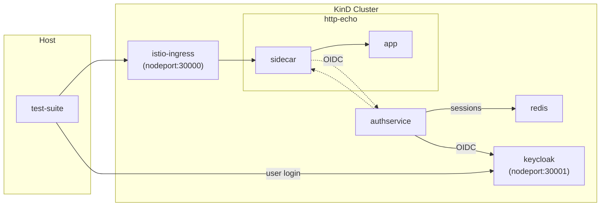

# Istio e2e tests

The [Istio](https://istio.io/) end-to-end tests are designed to verify the integration of the
Auth Service with Istio. They deploy a [KinD](https://kind.sigs.k8s.io/) Kubernetes cluster where Istio and the Auth Service are
installed and then run a series of tests to verify the integration. The following diagram shows the setup:



## Accessing the cluster from the host machine

For convenience, the Kind cluster Kubeconfig is generated in `cluster/kubeconfig`, and  an be used to access
the cluster from the host machine. For example:

```bash
$ kubectl --kubeconfig cluster/kubeconfig get namespaces
```

## Manually creating and destroying the cluster

The Kind cluster is automatically created and destroyed when running the test suites. However, it is
possible to manually create and destroy the cluster by running the following commands:

```bash
$ make kind-create
$ make kind-destroy
```

This is useful for debugging purposes.
