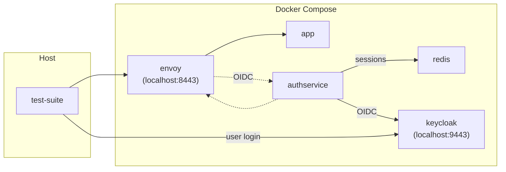

# Legacy e2e tests

The legacy e2e test suite has a configuration that is compatible with the old authservice, and
contains tests that validate that the current authservice can be used as a drop-in replacement
for the old one.

The test suite contains tests that use the Keycloak OIDC provider. A
Keycloak instance is deployed and configured in the Docker environment as the backend
OIDC provider. The following diagram shows the setup:

The setup is performed in the [setup-keycloak.sh](setup-keycloak.sh) script, which
configures the default `master` realm with:

* A user named `authservice` with a predefined password.
* A client named `authservice` with a predefined secret.

The user and client will be used in the e2e tests to verify the entire Authorization Code flow.
