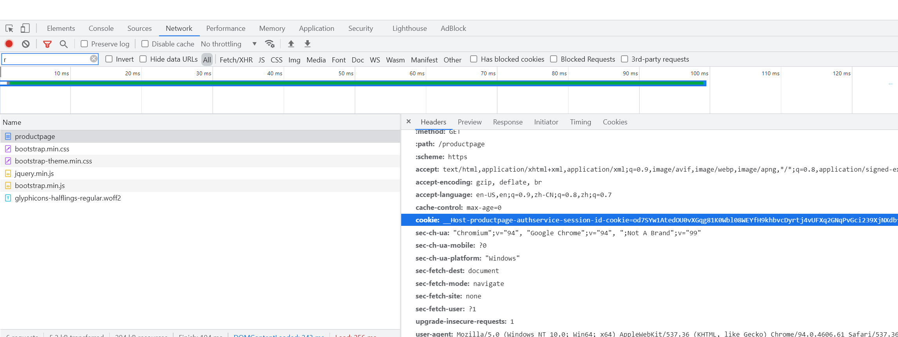
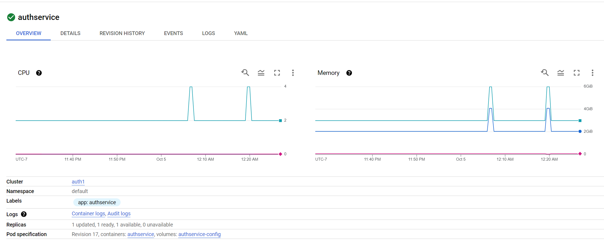

# Performance Testing

This document explains how to trigger a load test with large QPS.

## Pre Requisite

Set up an sample cluster with an application such as
[Bookinfo](https://github.com/istio-ecosystem/authservice/tree/master/bookinfo-example#bookinfo-with-authservice-example).

We will assume you deployed bookinfo as described above and will be able to access it at `localhost:8443/productpage`.

## Obtain the Session Cookie

Authservice provides SSO feature, which requires us to enter username and password to get a cookie
for a session state.

Use your browser to visit https://localhost:8443/productpage. For Chrome, open the inspector and
locate the "network" pannel. Refresh the page and choose the "productpage" request. You will see
the response contains the cookie which encodes the session.



Save this cookie as a variable. And start the load test with [Fortio](https://github.com/fortio/fortio).

```shell
export COOKIE_HEADER='cookie: bookinfo-session-affinity-cookie="foo";__Host-productpage-authservice-session-id-cookie=blablabla'
export LOAD_TEST_DURATIOn="6m"
fortio load -qps 800 -c 4 -t ${LOAD_TEST_DURATION} -k  -H ${COOKIE_HEADER} https://localhost:8443/productpage
```

You will see fortio output as below.

```
07:30:12 I commonflags.go:150> TLS certificates will not be verified, per flag request
Fortio dev running at 800 queries per second, 30->30 procs, for 2m0s: https://localhost:8443/productpage
07:30:12 I httprunner.go:81> Starting http test for https://localhost:8443/productpage with 200 threads at 800.0 qps
07:30:12 W http_client.go:146> https requested, switching to standard go client
Starting at 800 qps with 200 thread(s) [gomax 30] for 2m0s : 480 calls each (total 96000)
...
# target 75% 1.76078
# target 90% 1.91473
Sockets used: 0 (for perfect keepalive, would be 200)
Jitter: false
Code 200 : 9516 (100.0 %)
Code 400 : 4 (0.0 %)
Response Header Sizes : count 9520 avg 0 +/- 0 min 0 max 0 sum 0
Response Body/Total Sizes : count 9520 avg 4846.2399 +/- 480.3 min 116 max 5183 sum 46136204
All done 9520 calls (plus 200 warmup) 1713.690 ms avg, 116.4 qps
```

## Observe the Performance

You can observe the authservice performance using your own Kuernetes vendor tooling. If it's GCP,
you can find the workload containers memory and CPU usage at the console "Kubernetes > Workloads" pannel.

.
